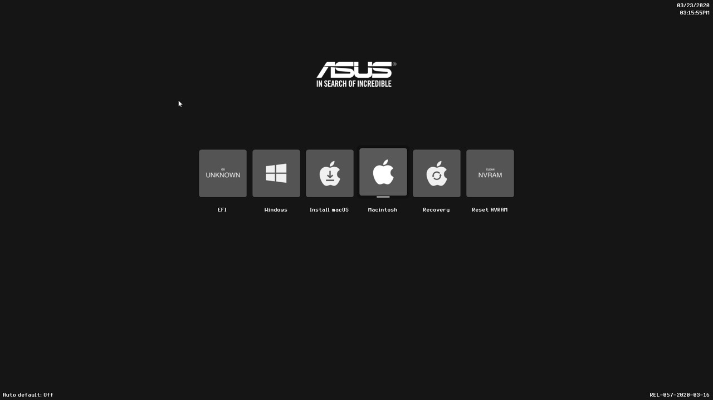

# Opencore theme builder

Simple project for making and NDK's Opencore themes

## Requirement

- Python3
- Sketch

## Introduction

- Modifier icons in icons folder
- Modifier wallpaper and font in misc
- Run `python3 generate.py -n=<theme-name(optional)>` to output zip file
- Replace all files in Opencore's icons folder with all files on zip files
- Done

## Example build

    

